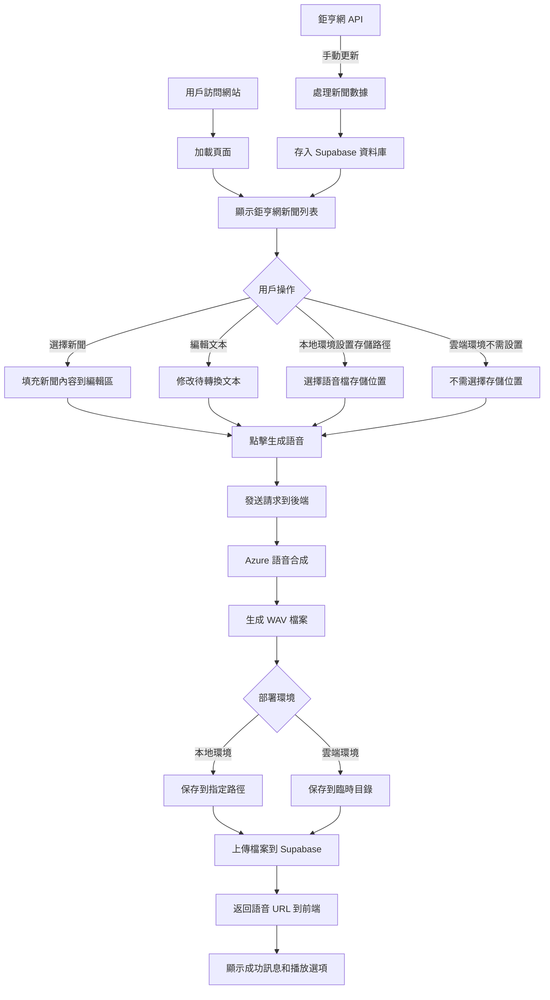
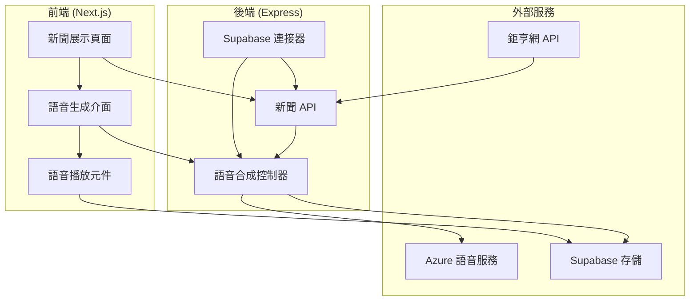
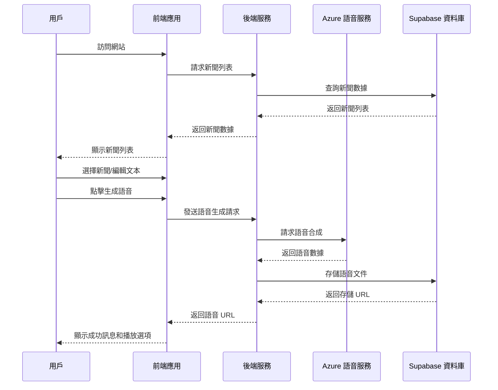

# 鉅亨網新聞語音合成器

[示範畫面&語音檔](https://github.com/jungang0414/ai_voice_generative_news/tree/main/server/voice)

## 架構

:::spoiler 整理流程

:::

:::spoiler 系統架構

:::

:::spoiler 數據流程

:::

## 主要功能

- 新聞爬取：自動從鉅亨網 API 獲取最新財經新聞
- 數據存儲：使用 [supabase](https://supabase.com/) 數據庫持久化存儲新聞內容
- 分頁顯示：前端實現了新聞列表分頁功能，每頁顯示 5 條新聞
- 語音合成：使用 Azure [Speech Studio](https://learn.microsoft.com/zh-tw/azure/ai-services/speech-service/speech-studio-overview) 將文本轉換為自然流暢的中文語音
- 自定義存儲路徑：允許用戶選擇語音文件的存儲位置

## 技術棧

- 前端：Next.js、React、Tailwind CSS
- 後端：Node.js、Express
- API：Azure Cognitive Services（語音合成）、鉅亨網 API（新聞數據）
- 數據存儲：Supabase（PostgreSQL）
- 其他：Microsoft Speech SDK、Axios、Github Copilot

## 技術特點

- 使用最新的 React Hooks 實現狀態管理
- 響應式設計，適配不同屏幕尺寸
- 錯誤處理和用戶友好的提示信息
- 安全的文件系統操作，包括路徑驗證和文件名清理
- 跨平台文件路徑兼容性

## 學習亮點

- API 設計與整合
- 數據爬取與處理
- 非同步操作管理
- 用戶界面設計與交互
- 錯誤處理與可靠性保障
- 第三方服務整合

## 若要在本地運行

克隆檔案至本地
```
git clone https://github.com/jungang0414/ai_voice_generative_news.git
```

cd server & cd client下載所需依賴
```
npm i
```

請新增.env至server資料夾並新增以下變數
```
GOOGLE_GENERATIVE_AI_API_KEY = "替換為自己的KEY"
SPEECH_CONFIG_API_KEY = "替換為自己的KEY"
SPEECH_CONFIG_ROGIN = "替換為自己的ROGIN"

PORT = "可以自己設定 不過Next預設會占用3000所以可以改成其他的"

SUPABASE_URL = "替換為自己的資料庫連結"
SUPABASE_KEY = "替換為自己的資料庫KEY"
```

運行伺服器
```
npm run server
```

前端頁面
```
npm run dev
```
